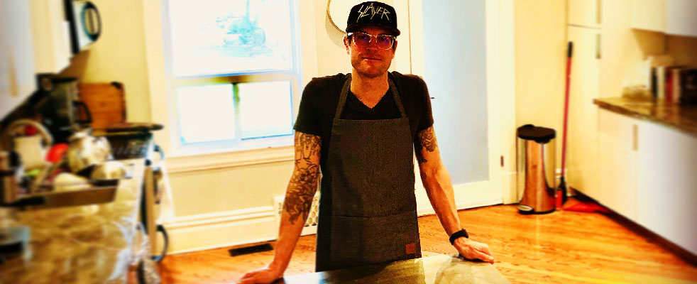

### Eugene Andruszczenko

> **Lead Engineer**
> *Manulife | LOFT*

#### LOFT

- We foresee, build, deploy and measure User Experiences for internal and external partners. 
- Have a direct impact on how we shape the future of insurance, finance and wellness. 
- The **LOFT** accelerates how our business partners deliver new digital products, services, and experiences to our customers.

#### About Me
> Hi, my name is Eugene, on the internets I am also known as 32teeth



I have been called many things
- [x] Hacker
- [x] Tinkerer
- [x] Maker
- [x] Builder

Non better define me than **Passionate**

-----

*"Eugene is a technologist at heart, and has over 20 years professional experience*

*Starting off early on in ‘ethical hacking’ and reverse engineering, has led him to enable more efficient, streamlined methods of applying technology to existing lag prone processes. Bias towards action & what works in practice are not just core beliefs, but mantras.*

*With a vast knowledge base ranging from hardware and circuit design, through middleware and connectivity to front end presentation tier, Eugene has continued to deliver customer and end client solutions through technological abstraction and driving core focus on business success criteria."*

-----


#### Merits
> A few, here and there, professional and personal

##### Alexa
* First to market with Amazon Alexa in Canada
* John Hancock RPS Skill

### Speaker Engagements
> Yeah, i talk, alot, about technology, and human computer interactions

###### [Can't Sell This](https://cantsellthispodcast.com/)
> Podcast Guest Speaker

- 2019 [Product Designer and Developer, Eugene Andruszczenko in Conversation](https://cantsellthispodcast.com/eugene-andruszczenko/)

###### [Voice Tech TO](https://voicetechglobal.com/)
> Showcase and Fireside Chat

- 2019 [Hey Alexa - ask Manulife to tell me a story.](https://www.meetup.com/voice-tech-global/events/266691671/)

###### [FITC Speaker](https://fitc.ca/speaker/eugene-andruszczenko/)
- 2018 [Introducing the Game Boy Zero: Handheld Edition](https://fitc.ca/presentation/introducing-game-boy-zero-handheld-edition/)
- 2014 [Sparky Jr. (Programmable RGB LED HID)](https://fitc.ca/presentation/sparkyjr-programmable-rgb-led-hid/)

### Things I've Built
> The short list version

#### Retro ESP32
> Retro ESP32 is a turbo charged Odroid Go Launcher, Emulator, ROM Manager and Hardware

[](https://github.com/retro-esp32/RetroESP32/releases/latest)
[![Downloads](https://img.shields.io/github/downloads/retro-esp32/RetroESP32/total?style=for-the-badge&color=hotpink&logo=data:image/gif;base64,R0lGODlhYgB3AKIFAMwAAN9fX/THx88PD////////wAAAAAAACH/C1hNUCBEYXRhWE1QPD94cGFja2V0IGJlZ2luPSLvu78iIGlkPSJXNU0wTXBDZWhpSHpyZVN6TlRjemtjOWQiPz4gPHg6eG1wbWV0YSB4bWxuczp4PSJhZG9iZTpuczptZXRhLyIgeDp4bXB0az0iQWRvYmUgWE1QIENvcmUgNS42LWMxMzggNzkuMTU5ODI0LCAyMDE2LzA5LzE0LTAxOjA5OjAxICAgICAgICAiPiA8cmRmOlJERiB4bWxuczpyZGY9Imh0dHA6Ly93d3cudzMub3JnLzE5OTkvMDIvMjItcmRmLXN5bnRheC1ucyMiPiA8cmRmOkRlc2NyaXB0aW9uIHJkZjphYm91dD0iIiB4bWxuczp4bXA9Imh0dHA6Ly9ucy5hZG9iZS5jb20veGFwLzEuMC8iIHhtbG5zOnhtcE1NPSJodHRwOi8vbnMuYWRvYmUuY29tL3hhcC8xLjAvbW0vIiB4bWxuczpzdFJlZj0iaHR0cDovL25zLmFkb2JlLmNvbS94YXAvMS4wL3NUeXBlL1Jlc291cmNlUmVmIyIgeG1wOkNyZWF0b3JUb29sPSJBZG9iZSBQaG90b3Nob3AgQ0MgMjAxNyAoTWFjaW50b3NoKSIgeG1wTU06SW5zdGFuY2VJRD0ieG1wLmlpZDpCOUQzNzMwM0RENzcxMUU5ODg0M0IzRDNEM0E3MUNENSIgeG1wTU06RG9jdW1lbnRJRD0ieG1wLmRpZDpCOUQzNzMwNERENzcxMUU5ODg0M0IzRDNEM0E3MUNENSI+IDx4bXBNTTpEZXJpdmVkRnJvbSBzdFJlZjppbnN0YW5jZUlEPSJ4bXAuaWlkOkI5RDM3MzAxREQ3NzExRTk4ODQzQjNEM0QzQTcxQ0Q1IiBzdFJlZjpkb2N1bWVudElEPSJ4bXAuZGlkOkI5RDM3MzAyREQ3NzExRTk4ODQzQjNEM0QzQTcxQ0Q1Ii8+IDwvcmRmOkRlc2NyaXB0aW9uPiA8L3JkZjpSREY+IDwveDp4bXBtZXRhPiA8P3hwYWNrZXQgZW5kPSJyIj8+Af/+/fz7+vn49/b19PPy8fDv7u3s6+rp6Ofm5eTj4uHg397d3Nva2djX1tXU09LR0M/OzczLysnIx8bFxMPCwcC/vr28u7q5uLe2tbSzsrGwr66trKuqqainpqWko6KhoJ+enZybmpmYl5aVlJOSkZCPjo2Mi4qJiIeGhYSDgoGAf359fHt6eXh3dnV0c3JxcG9ubWxramloZ2ZlZGNiYWBfXl1cW1pZWFdWVVRTUlFQT05NTEtKSUhHRkVEQ0JBQD8+PTw7Ojk4NzY1NDMyMTAvLi0sKyopKCcmJSQjIiEgHx4dHBsaGRgXFhUUExIREA8ODQwLCgkIBwYFBAMCAQAAIfkEAQAABQAsAAAAAGIAdwAAA/9YtNz+MMpJq3Xq6s27/2AojmRpnmiqrmzrvnAsz7Ra3Hiu73zv/z0XcEgsEoXGpLKIXDqfuSZ0qpRSr0MrdsvTcr83L5grHmPLZio6DV2zne53tSX/xutMOv4MEgQGAQIRe3wfAQCIAYOEaiADiAADi4xtIIeJk5RwfX+BmZpzLKBPd6M6paY4qKkZoqxGq6mxprOjtaC3mrmUu4y9hL97wXjDdcVyx2/JbMtpzWbPY9Fg03Z6r0fX2EDVZNrbPt1b4oUr4Fnf5zvkV+yNrupBGq019RL09vkMYfr9C/z+8qkKaC8KwXoGD8pYpzBGl4ZoIJqLR7GixYsYM2rcyLGoo8ePIL3tC1npXrsJ2yycNMlq3hQKrzi8RCmrQ8lPumySoklL5yaWuD7sBJrTw1CcvoT+RApMqbwT5Qg8NBoOxUyiVKtCPQo061MTXHl6nQp2iUyAF9BtTZLVJTeroTYk5Pl2LSyfaCHctZttbF6zcPfiHRc4j19ldK8ORpb45llhjR2nTUpUsVvIlSWrpMw0LExekS2HZpz53WjSnUVjIMmVtevXSRIAADs=)](https://github.com/retro-esp32/RetroESP32/releases)
[]()


##### Retro ESP32 in the news:
- [Geeky Gadgets](https://www.geeky-gadgets.com/game-boy-pocket-retro-esp32-board-15-08-2019/)
- [Odroid Magazine](https://magazine.odroid.com/article/retro-esp32-the-ultimate-emulation-image-for-your-odroid-go/)
- [Happy Gamer](https://happygamer.com/bring-your-old-nintendo-game-boy-pocket-back-to-life-with-the-esp32-wrover-board-22764/)
- [Gaming Gadgets](https://gaminggadgets.de/retro-esp32-aus-eurem-gameboy-pocket-wird-ein-retro-handheld)
- [SBC | Retro Game Handhels](https://www.rghandhelds.com/sbc-devices)

###### GamePad
> So you want to add a gamepad to a html5/canvas based app in [html5](http://html5.apache.org/)

```npm i hud-gamepad```


###### Wii Accessory Extension
> Create Your Own Controller for Wii/WiiU


[GitHub](https://github.com/32teeth/WiiController32u4)

###### OLED Tetris
> It's Tetris, on an 128x32 OLED


[GitHub](https://github.com/32teeth/OLED-Tetris)

###### Voltage Converters
> Herein are a collection of Voltage / Boost Converters built for different projects using different ICs Best thing to do is read the whitepapers if you decide to make your own


[GitHub](https://github.com/32teeth/VoltageConverters)

###### Gaboze Pocaio
> Raspberry Pi Zero based arcade in you pocket, and in your Gameboy Pocket


[GitHub](https://github.com/Gaboze-Pocaio/Round-2)

###### Convert PNG to ROM art
> Create .art crc32 format ROM art


[GitHub](https://github.com/retro-esp32/Convert-Image-to-ROM-art)

###### Convert Image To Byte Array
> Online Image To Array Converter for C/C++

[GitHub](https://github.com/retro-esp32/Convert-Image-To-Byte-Array)

### Colloboration
> Always open to conversations

|    [](https://github.com/32teeth)[](https://www.instagram.com/gabozepocaio/)[](https://www.facebook.com/messages/t/gabozepocaio)|
| ---- |
| Find me on the internet |

-----

# Thank you for reading
> You've made it this far...  ...be sure to **⭐ Star** Me

I'll ⭐ star you back. Because we are all 🌟 stars!
